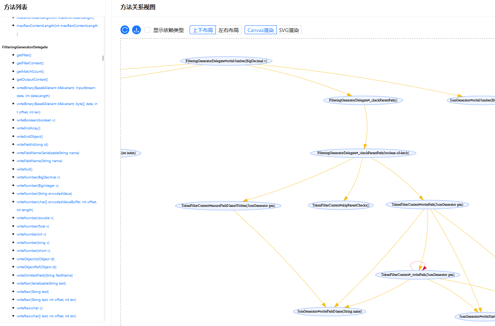
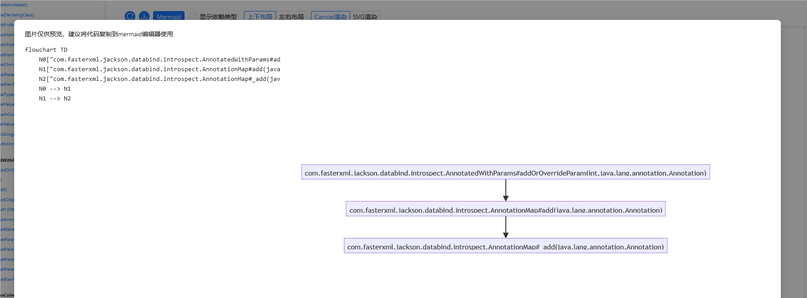
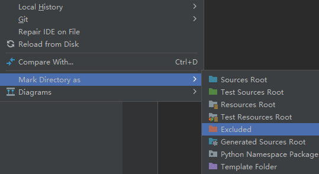
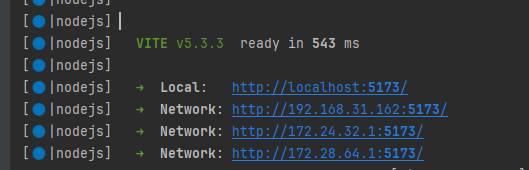

## 简介

这个项目是基于 [javaparser](https://github.com/javaparser/javaparser) 实现的方法关系绘制工具，它可以在开发环境下帮你生成方法关系图，为代码分析和源码阅读提供直观的视觉辅助。




你还可以用它生成 [mermaid](https://mermaid.js.org/) 流程图代码，以便于在文档撰写等场景使用。



## 使用方法

1. 确保 JDK 版本不小于 17。

2. 安装 node.js（版本不低于 18），并确保 node 和 npm 全局可访问。
   > 你不需要掌握任何前端技能，只需确保 node.js 已在机器上安装即可。

3. 下载本项目源码，使用 IntelliJ IDEA 打开。
   > 本项目使用 `lombok`，你的 IDEA 需要有 `lombok` 插件。

4. （可选）将 `main` 模块的 `src/main/web` 目录标记为已排除，防止 IDEA 对 `node_modules` 目录构建索引而导致卡死。
   > 右键点击目录 -> Mark Directory as（将目录标记为） -> Excluded（已排除）
   >
   > 

5. 为 `main` 模块的 `ServerApplication` 启动类添加 VM 参数 `work-path`，取值为你要分析的项目的路径。
   > 例如 `-Dwork-path=C:\code\projects\jackson`
   > 
   > 你也可以直接修改 `MyAppConfig` 类的构造方法，将目标项目的路径传给父类构造方法 `super(xxxxxx)` 

6. 启动项目（`ServerApplication`），待控制台输出前端访问地址（[http://localhost:5173](http://localhost:5173)）后通过浏览器访问。
   > 

7. 从页面左侧点击选择入口方法，页面右侧将会显示对应的方法依赖链路。

## 配置

你可以通过修改 `main` 模块的 `MyAppConfig` 类对本工具的行为进行配置。

部分配置方法要求你对 javaparser 有一定的了解。

下面列出几个常用的配置。

### 配置页面左侧需要展示的方法

默认情况下，前端页面左侧方法列表展示的是所有 public 的非静态方法。

你可以通过在 `MyAppConfig` 中实现 `public Function<AstIndexContext, List<MethodListItemView>> getMethodListLoader()` 方法来替换该策略。

项目的 `ParserConstants` 类中自带了两种策略，分别是 `GET_ALL_PUBLIC_INSTANCE_METHODS` 和 `GET_CONTROLLER_REQUEST_MAP_METHODS`，前者即为默认策略，后者会返回所有 Controller 类的请求方法。

所以，如果你想把前端页面左侧的方法列表更换为 Controller 方法列表，可以这样实现 `getMethodListLoader` 方法：

```java
import io.github.yuanbug.drawer.parser.ParserConstants;

public class MyAppConfig extends DefaultAstParsingConfig implements WebViewConfig {
    @Override
    public Function<AstIndexContext, List<MethodListItemView>> getMethodListLoader() {
        return ParserConstants.GET_CONTROLLER_REQUEST_MAP_METHODS;
    }
}
```

如果你想实现自定义策略，可以参考这两种策略的写法。

### 配置子类解析策略

默认情况下，本工具在判断一个方法是否存在覆写方法时，会判断方法所在类是否只有一个直接子类，如果是，并且这个子类中存在相同签名的方法，则会对这个覆写方法进行解析和绘制。

如果方法所在类不存在子类，或者直接子类超过一个，就不会解析和绘制覆写方法。

你可以通过在 `MyAppConfig` 中实现 `public BiFunction<ClassOrInterfaceDeclaration, AstIndexContext, List<ClassOrInterfaceDeclaration>> getDirectlySubTypeParser()` 方法来替换该策略，例如：

```java
import io.github.yuanbug.drawer.parser.ParserConstants;

public class MyAppConfig extends DefaultAstParsingConfig implements WebViewConfig {
    @Override
    public BiFunction<ClassOrInterfaceDeclaration, AstIndexContext, List<ClassOrInterfaceDeclaration>> getDirectlySubTypeParser() {
        // 这个策略会返回所有直接子类；如果不需要解析覆写方法，可以使用NO_DIRECTLY_SUB_TYPE_PARSER
        return ParserConstants.ALL_DIRECTLY_SUB_TYPE_PARSER;
    }
}
```

### 配置要解析的代码模块

默认情况下，本工具启动时会扫描你指定的项目目录，找出所有 `src/main/java` 目录，从而识别出所有代码模块。

如果你的项目是 Maven 项目，本工具会从 `pom.xml` 文件读取模块名，否则使用目录名称作为模块名。

如果你需要进行自定义，可以在 `MyAppConfig` 中实现 `public List<CodeModule> getModules()` 方法，就像这样：

```java
public class MyAppConfig extends DefaultAstParsingConfig implements WebViewConfig {
    @Override
    public List<CodeModule> getModules() {
        return List.of(CodeModule.builder()
                .name("模块名")
                .srcMainJavaPath(new File("项目的src/main/java目录路径").toPath())
                .build());
    }
}
```
